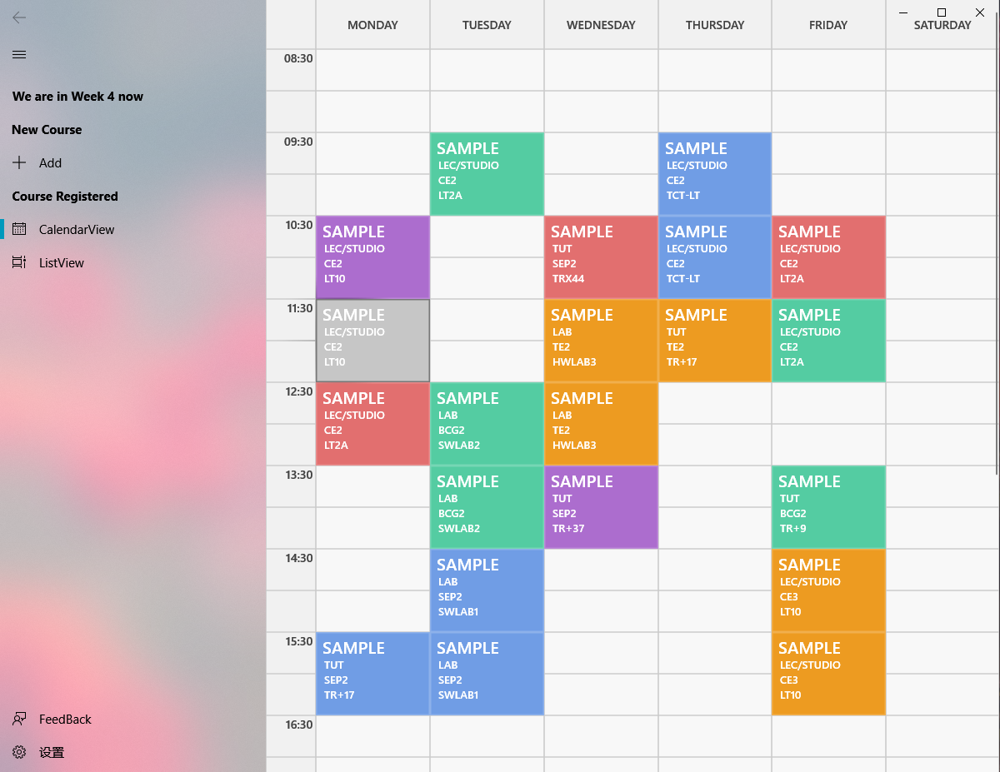
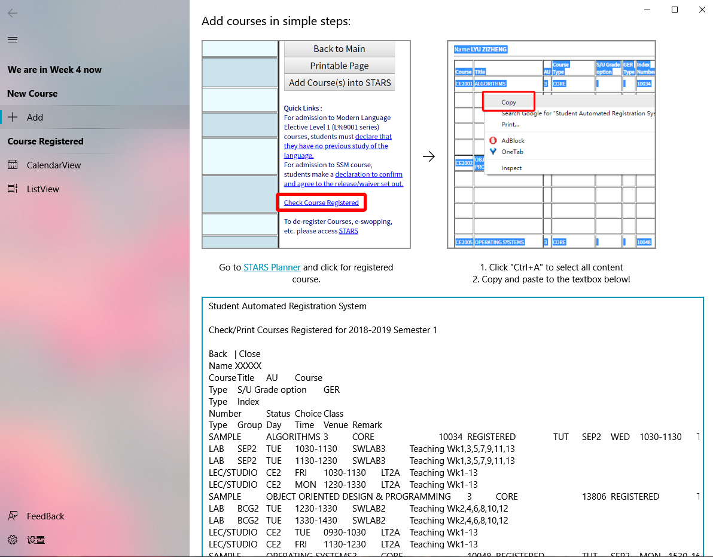

# NTU TimeTable UWP App

As the STARS Planner and STARS is way too **ugly** for me. I designed this good looking timetable display app just for a pleasant viewing experience

We already have a lot of stressful courses why not make the timetable look nicer and pleasing.

## Feature:

Automatically parse ur courses and form timetable!  
Fluent Desgin Language  
Virbrant Colors  
Display only the course u have in **CURRENT WEEK** 

## PRIVACY:

The app doesnot connect the Internet so no privacy issue, it is a offline **UWP app** thus is cleaner and saher than an **.exe app**

## INSTALLATION:

Download this release and unzip and follow instruction
Minimum System Requirements:  
**Windows 10 Version 1803 (10.0; Build 10.0.17134.0)**
