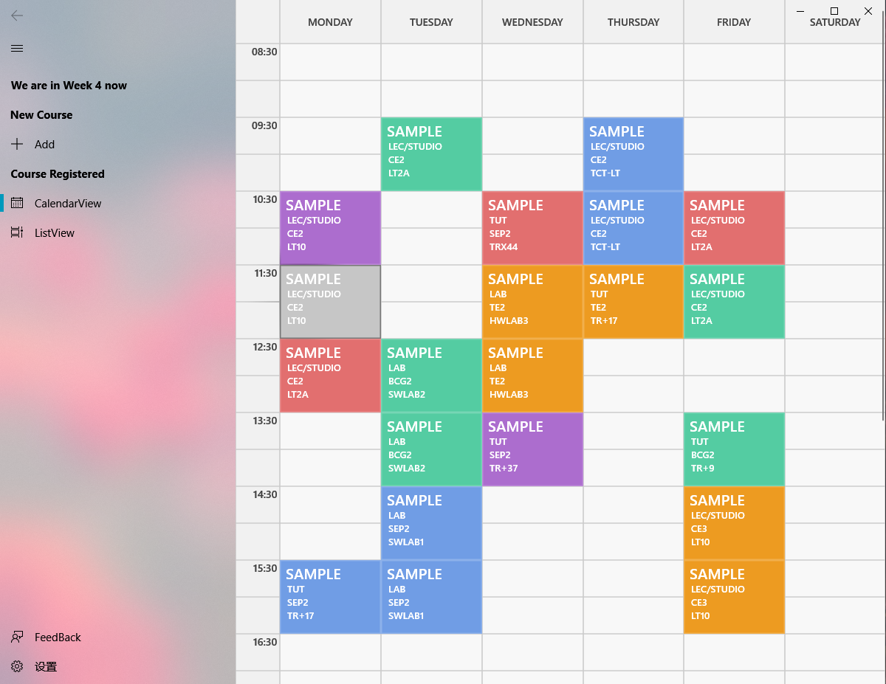

As the STARS Planner and STARS are way too **ugly** for me. I designed this good looking timetable display app just for a pleasant viewing experience

We already have a lot of stressful courses why not make the timetable look nicer and pleasing.

## Feature:

* **Automatically** parse your courses and form timetable!  
* Fast launch, low memory comsupmtion and no background process   
* Fluent Desgin Language  
* Virbrant Colors  
* Display only the course you have in **CURRENT WEEK** 
* Find the best non clash combination of the courses you choose

## PRIVACY:
 

<a href="privacy.html">Privacy Policy</a>   
The app only connects the internet when parsing the courses info. It is a light weight **UWP app** which is much cleaner and safer than an **.exe app**

## INSTALLATION:

 

Minimum System Requirements:  
**Windows 10 Version 1803 (10.0; Build 10.0.17134.0)**
